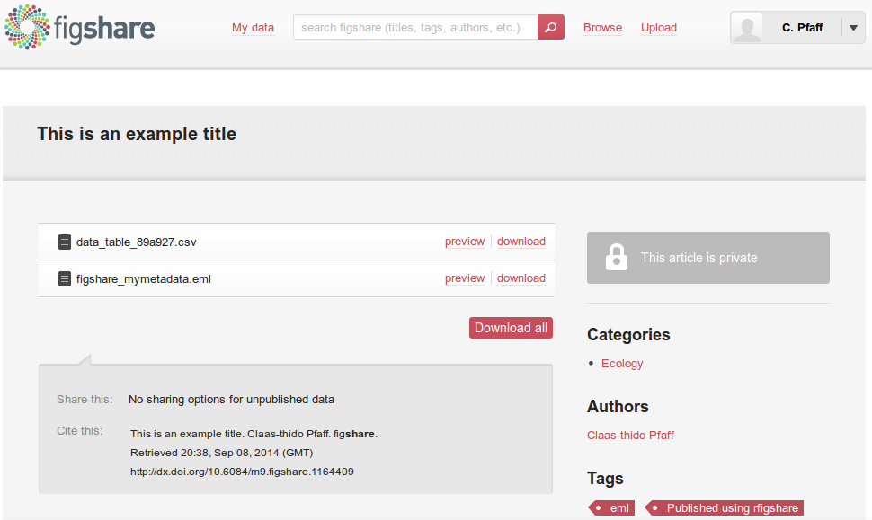
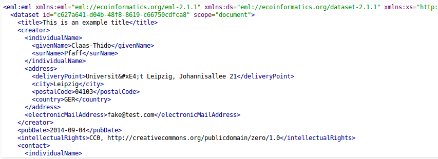
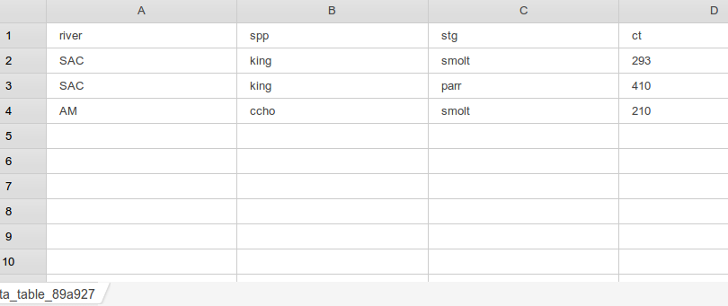

## Introduction

* Ecological Metadata Language (XML)
  * Allows to describe aspects of data:
    * Units and categories of data columns
    * Temporal and spatial coverage ...
    * Contacts ... and much more
  * In a structured machine readable way
  
* The R package for EML
  * Introduces a wide spread standard
  * Well established Statistics environment
  * Read + Write metadata, Publish (Data + Metadata)

---

## About the package
  
* Part of the rOpenSci community
  * Data-Acess, Vizualisation, Reproducibility... 30+)
  * rgbif (Global Biodiversity Information Facility)
  * taxize (20+ Taxonomic Databases for e.g. species name resolving) 
  * rBEFdata (Access to BEFdata data management platforms)
  
* The EML package is developed by:


---

## Install the package

* Not yet available via CRAN
* Source code via GitHub
  * https://github.com/ropensci/EML
  
* Devtools (Hadley Wickham)
  
```
install.packages("devtools")
library("devtools")
```

* Install from github

```
install_github("ropensci/EML", build=FALSE, dependencies=c("DEPENDS", "IMPORTS"))
library("EML")
```

---

## Read metadata
  
* Read metadata from any EML formated source (File, URL, KNB-ID)


```r
metadata <- eml_read("http://china.befdata.biow.uni-leipzig.de/datasets/334.eml")
```

* Then use `eml_get(metadata, "xy")`
  - csv_filepaths
  - coverage
  - contact
  - unit.defs
  - col.defs
  - creator
  - data.set ...

---

## Read metadata
  

```r
eml_get(metadata, "creator")
```

```
## [1] "Anne Lang <anne_christina.lang@uni-leipzig.de> [cre]"
## [2] "Werner Härdtle <haerdtle@uni-lueneburg.de> [cre]"   
## [3] "Goddert von Oheimb <vonoheimb@uni.leuphana.de> [cre]"
```
  

```r
eml_get(metadata, "coverage")
```

```
## geographicCoverage:
##   geographicDescription: "The experiment was set up in the northeast part of Jiangxi
##     Province, P.R. China (N 29° 06.29 E 117° 55.28). \n"
##   boundingCoordinates:
##     westBoundingCoordinate: '117.89978'
##     eastBoundingCoordinate: '118.148346'
##     northBoundingCoordinate: '29.285201'
##     southBoundingCoordinate: '29.101777'
## temporalCoverage:
##   rangeOfDates:
##     beginDate:
##       calendarDate: |2
## 
##         2009-08-26
##     endDate:
##       calendarDate: |2
## 
##         2010-09-26
## taxonomicCoverage:
##   taxonomicClassification:
##     commonName: |2+
## 
##       tree species (Schima superba, Elaeoarpus decipiens, Castanea henryi, Quercus serrata)
```

---

## Import data

* Access the data based on metadata information
  


```
example_dataset = eml_get(metadata, "data.set")
```

* Just display a subset of it here


```r
example_dataset[1:4, 1:3]
```

```
##     plot_id             Spp Leaf_15N_recovery_g_T5
## 1 pilot1C09 Castanea henryi              1.504e-05
## 2 pilot1D10 Castanea henryi              8.604e-05
## 3 pilot2C11 Castanea henryi              2.905e-05
## 4 pilot2D01 Castanea henryi              8.923e-06
```

---

## Describe your own
   
* Starting with 4 columns of data


```r
river = c("SAC",  "SAC",   "AM")
spp   = c("king",  "king", "ccho")
stg   = c("smolt", "parr", "smolt")
ct    = c(293,    410,    210)
```

* Put them together in a `data.frame`


```r
undescribed_data = data.frame(river, spp, stg, ct)
undescribed_data
```

```
##   river  spp   stg  ct
## 1   SAC king smolt 293
## 2   SAC king  parr 410
## 3    AM ccho smolt 210
```

---

## Describe your own

* EML package adds `data.set(data.frame, col.defs =, unit.defs =)`

* `col.defs` (plain text definition)


```r
col_defs = c("River site used for collection",
             "Species common name",
             "Life Stage",
             "count of live fish in traps")
```

- `unit.defs` (factor => levels, dates => YYYY or MM-DD-YY, numeric => unit list KNB)


```r
unit_defs = list(c(SAC = "The Sacramento River", AM = "The American River"),
                 c(king = "King Salmon", ccho = "Coho Salmon"),
                 c(parr = "third life stage", smolt = "fourth life stage"),
                 "number")
```

---

## Put dataset together

* Put together with `data.set()`


```r
described_dataset = data.set(undescribed_data,
                             col.defs = col_defs,
                             unit.defs = unit_defs)
```

* However there is still general information missing:
  - title (add now)
  - absract
  - temporal and spatial coverage
  - contact person (add now)
  - creator
  - and other things ...

---

## Add contact

* Create person object using


```r
claas = eml_person("Claas-Thido Pfaff <fake@test.com>")
```

* Coerce to a contact object


```r
claas_contact = as(claas, "contact")
```

* Add an address


```r
address <- new("address",
               deliveryPoint = "Universität Leipzig, Johannisallee 21",
               city = "Leipzig",
               postalCode = "04103",
               country = "GER")
claas_contact@address = address
```

---

## Put together and save

* The `eml()` command assembles everything


```r
data <- eml(dat = described_dataset,
            title = "This is an example title",
            contact = claas_contact
            )
```

* Write out the EML to a file


```r
eml_write(data, file="mymetadata.eml")
```

* Publish to figshare (requires `rfigshare` package)


```r
eml_publish("mymetadata.eml", 
            description="Example EML file from EML",
            categories = "Ecology", 
            tags = "EML", 
            destination="figshare")
```

---

## Uploaded to FigShare



---

## Uploaded to FigShare

* Metadata



* Data



---

## Wrap-up

* The `EML` package
  - Access to metadata 
  - Access to data
  - From any EML formatted source!
  - Describe your own data with metadata
  - Allows publication of citable data products

* This was very brief intro:
  - Just visit GitHub for more!
  - https://github.com/ropensci/EML

---

<div class = "flushcenter">
  <h1>Thanks for your attention!</h1>
  <h1>Any questions?</h1>
</div>
  
<br>
 * Find this slides: 
<br>
  http://cpfaff.github.io/emlrpackage/#1
<br>
 * Find EML package: 
<br>
  https://github.com/ropensci/EML


